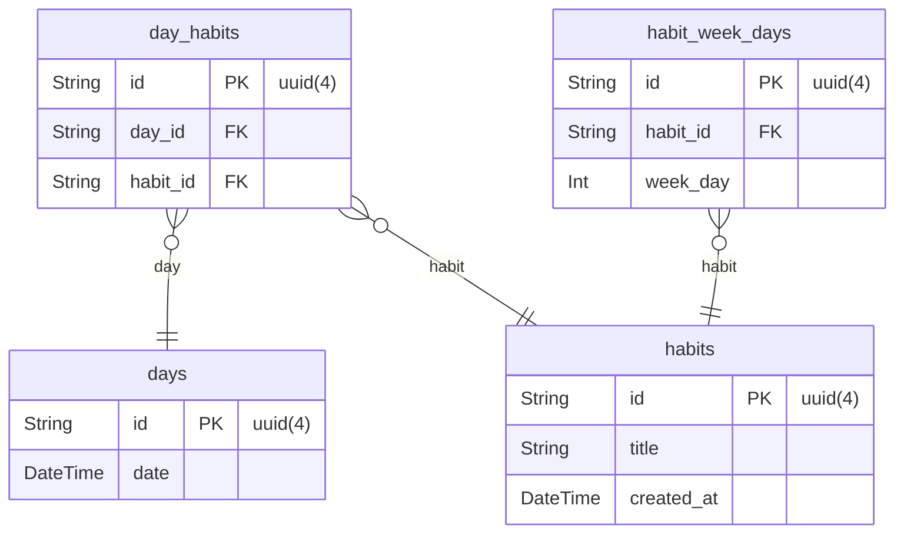

# Habits Tracker Documentation

## Overview

The Habits Tracker is a full-stack application that helps users track and maintain daily habits. It features a web interface, mobile app, and RESTful API backend. The project consists of three main parts:

- Web frontend (React + TypeScript)
- Mobile app (React Native + Expo)
- Backend server (Node.js + Fastify)

## Technology Stack

### Backend (server)

- Node.js with TypeScript
- Fastify for API server
- Prisma for database ORM
- SQLite as database
- Zod for validation
- Swagger for API documentation

### Frontend (front)

- React with TypeScript
- Vite as build tool
- Tailwind CSS for styling
- Radix UI for accessible components
- Axios for API requests
- Day.js for date handling
- CLSX for conditional classnames

### Mobile App (mobile)

- React Native
- Expo framework
- React Navigation
- Reanimated for animations

## Project Structure

```structure
└── project/
    ├── front/              # Web frontend
    │   ├── src/
    │   │   ├── components/ # React components
    │   │   ├── lib/        # Utilities and configurations
    │   │   └── styles/     # Global styles
    │   └── public/         # Static assets
    ├── mobile/             # Mobile application
    │   ├── src/
    │   │   ├── screens/    # Mobile screens
    │   │   ├── components/ # Reusable components
    │   │   └── routes/     # Navigation setup
    │   └── assets/         # Mobile assets
    └── server/             # Backend
        ├── src/
        │   ├── lib/        # Shared utilities
        │   └── routes.ts   # API routes
        └── prisma/         # Database schema and migrations
```

## Database Schema




## Getting Started

### Prerequisites

- Node.js 18+
- npm/yarn
- Expo CLI (for mobile)

### Installation

1. Install dependencies for each project:

```bash
# Backend
cd server
npm install

# Frontend
cd front
npm install

# Mobile
cd mobile
npm install
```

2. Set up the database:

```bash
cd server
npx prisma migrate dev
npx prisma db seed
```

3. Start the application:

```bash
# Backend
cd server
npm run dev

# Frontend
cd front
npm run dev

# Mobile
cd mobile
npx expo start --clear
```

## API Endpoints

- `POST /habits` Create a new habit
- `GET /day` Get habits for specific day
- `PATCH /habits/:id/toggle` Toggle habit completion
- `GET /summary` Get habits completion summary

### API Documentation

The API documentation is available through Swagger UI at:

- `http://localhost:3000/docs` - Interactive API documentation
- `http://localhost:3000/docs/json` - OpenAPI specification

To access the documentation:

1. Start the server: `npm run dev`
2. Open your browser and navigate to `http://localhost:3000/docs`

<!-- npx watch:
npx tsc --init:
npx prisma migrate dev:
npx npm-check-updates -u:
npx prisma studio:
npx prisma generate:
npx prisma db push:
npx prisma db seed:
npx create-expo-app@latest mobile --template:
npx expo install expo-font @expo-google-fonts/inter:
-->
<!-- Em tailwind os valores são divididos por 4
gap-16 = 4rem = 64px -->
