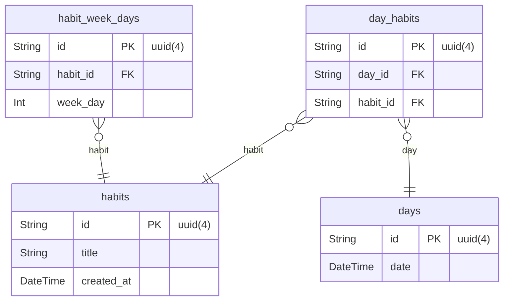

```mermaid
erDiagram
	habits {
		String id PK  "uuid(4)"
		String title
		DateTime created_at
	}
	days {
		String id PK  "uuid(4)"
		DateTime date
	}
	day_habits {
		String id PK  "uuid(4)"
		String day_id FK
		String habit_id FK
	}
	habit_week_days {
		String id PK  "uuid(4)"
		String habit_id FK
		Int week_day
	}
	day_habits }o--|| habits : habit
	day_habits }o--|| days : day
	habit_week_days }o--|| habits : habit

```
